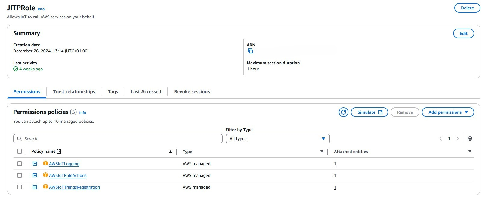
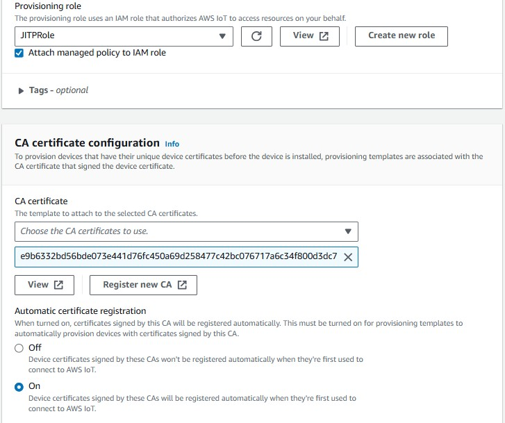
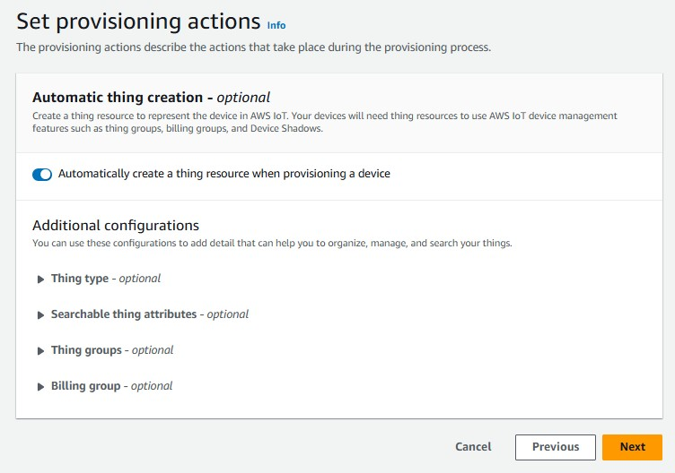
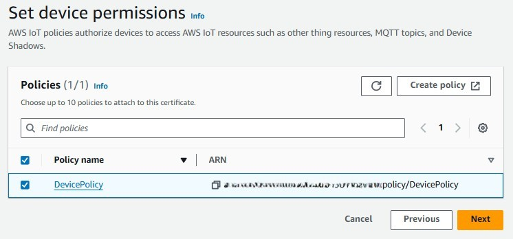
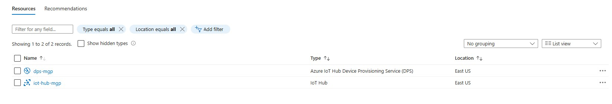
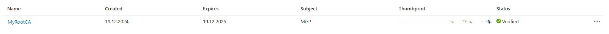
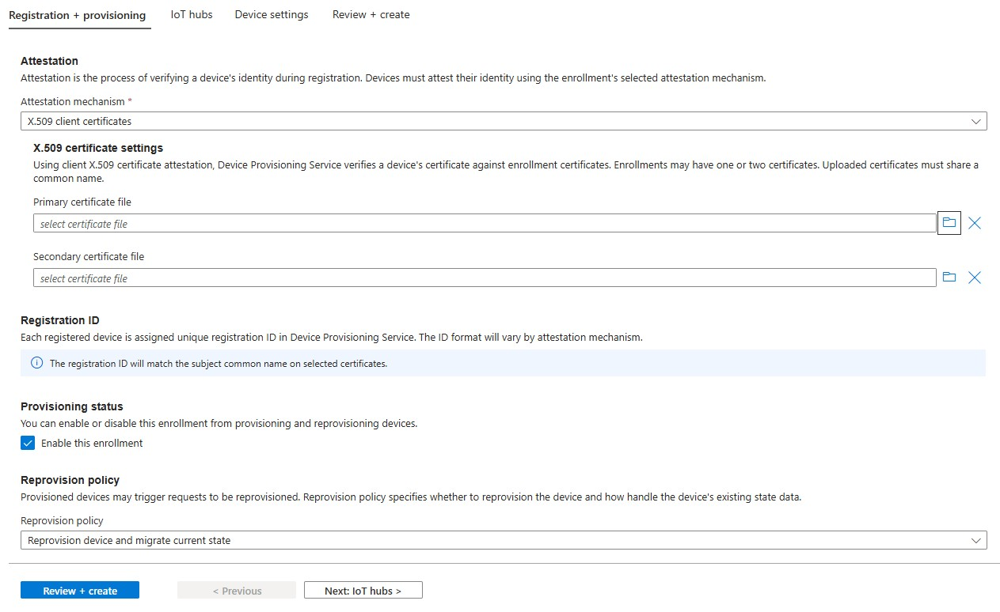
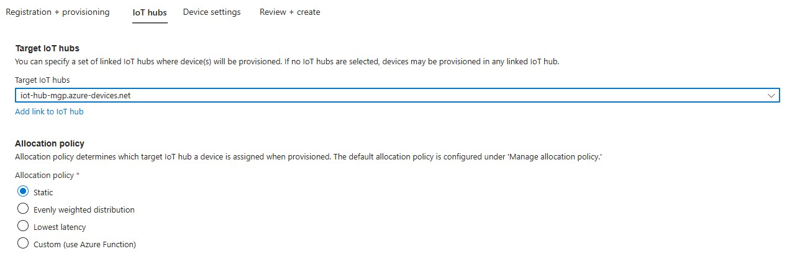

# Automatic device registration in CSP (AWS, Azure)

The project implements how to automatically configure IoT devices and register them with cloud services (AWS and Azure). 
All this using X.509 certificates to secure communication between the device and the cloud. 
In the project the Raspberry Pi 3A+ with rpios and the DHT11 sensor were used as the test environment.

## Technologies
*   **Python**
*   **Ansible**
*   **AWS Iot Core**
*   **Azure Iot Hub & Azure Device Provisioning**
*   **Terraform**

## Main solutions

* **Generate certificates:**
    * A script has been developed using OpenSSL to generate Root CA and certificates for devices.
* **Cloud services configuration**
    * Proper configuration of IoT services in Azure and AWS to enable automatic device enrollment and data upload using X.509 certificates.
* **Python apps:**
    * Simple python applications using SDK from AWS and Azure to connect to the cloud and send data via MQTT protocol.
* **Ansible:**
    * Ansible automates IoT device configurations and certificate rotations 

## Certificates
A script is used to generate certificates, it generates Root CA and certificates along with keys for the device. 
Once the Root CA is in place, the script will skip this and you can generate certificates for more devices.

## Ansible
A special role has been created in ansible that automates the entire process of configuring the device. 
It creates a special user to run applications, creates an environment for python applications, copies files and certificates and creates a service for python applications.
A playbook has also been developed to support certificate rotation. At this point, the role and playbook have been developed only for AWS.

## Python
Simple python applications used SDKs from Azure and AWS. An application was also developed to read data from the sensor. Azure required two apps - one that to register the device in the cloud (run once) and another to send the data. In the case of AWS, one application was responsible for registering and sending data. Both applications used the MQTT protocol.

## Cloud
Below describes in general terms, without details of what had to be configured in the cloud. The screens are illustrative.

## Terraform
You can easily build up infrastructre (in AWS) using terraform files.
All you have to do is:
```
terraform init
terraform plan
terraform apply
```
It creates: IAM Role, Device Policy and Provisoning template

### AWS
For AWS, the AWS IoT Core service requires configuration.

The first step was to upload the previously generated Root CA to AWS IoT Core.
* Register Root CA:
    * 


Then a policy had to be created for the device, which was assigned to the certificate with which the device was presented. 
This policy allows the device to connect and send data.
* Device policy:
    * 

The next step was to create a role for the “Just in time provisioning” template. 
It allowed to assign a policy to a certificate and register devices.
* JITP Role:
    * 


The last step was to configure the “Just in time provisioning” template. 
Selecting and using the previously configured policy for the device, role and CA in it.
JSON template can be found in /aws/jitp_template.json
* Just in time provisioning template:
    * 
    * 
    * 

### Azure
In Azure, the configuration had to be done on two services. Azure IoT Hub and IoT Hub Device Provisioning Service.

A resource group has been created in which IoT Hub and Device Provisoing Service have been placed.
* Resource group with resources
    * 


Then, in each service, you had to upload Root CA and go through the PoP (Proof of possesion) process
* Uploaded cert
    * 


The next step was to stow the enrollemnt task. In this case, I created an enrollemnt for one device.
* Individual enrollemnt
    * 

Then linked a IoT Hub to Device provisioning service
* Link IoT Hub
    * 


