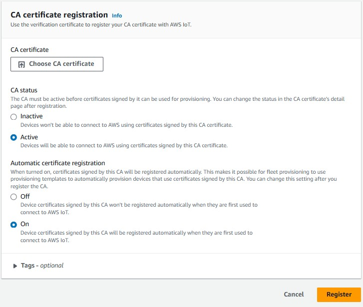
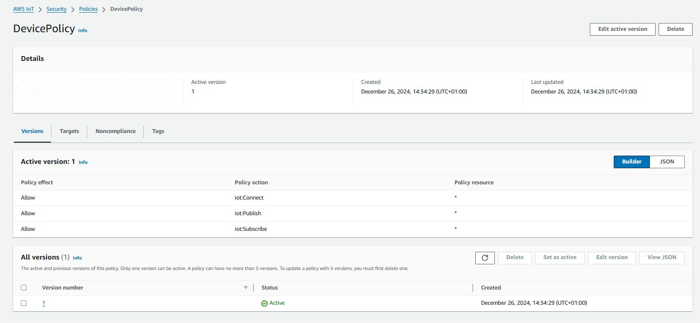

# Automatic device registration in CSP (AWS, Azure)

The project implements how to automatically configure IoT devices and register them with cloud services (AWS and Azure). 
All this using X.509 certificates to secure communication between the device and the cloud. 
In the project the Raspberry Pi 3A+ with rpios and the DHT11 sensor were used as the test environment.

## Technologies
    * Python
    * Ansible
    * AWS Iot Core
    * Azure Iot Hub & Azure Device Provisioning

## Main solutions

* **Generate certificates:**
    * A script has been developed using OpenSSL to generate Root CA and certificates for devices.
* **Cloud services configuration**
    * Proper configuration of IoT services in Azure and AWS to enable automatic device enrollment and data upload using X.509 certificates.
* **Python apps:**
    * Simple python applications using SDK from AWS and Azure to connect to the cloud and send data via MQTT protocol.
* **Ansible:**
    * Ansible automates IoT device configurations and certificate rotations 

## Certificates
A script is used to generate certificates, it generates Root CA and certificates along with keys for the device. 
Once the Root CA is in place, the script will skip this and you can generate certificates for more devices.

## Ansible
A special role has been created in ansible that automates the entire process of configuring the device. 
It creates a special user to run applications, creates an environment for python applications, copies files and certificates and creates a service for python applications.
A playbook has also been developed to support certificate rotation. At this point, the role and playbook have been developed only for AWS.

## Python
The python applications leverage cloud providers' SDKs, certificates and the MQTT protocol. The solution supports automatic registration of devices in the cloud and secure uploading of data. This allows automatic device registration in the cloud without administrator intervention. The device itself will connect to the appropriate endpoint and if the certificate matches the cloud services will register it and it can send data.

## AWS
For AWS, the AWS IoT Core service requires configuration.

The first step was to upload the previously generated Root CA to AWS IoT Core.
* Register Root CA:
    * 

Then a policy had to be created for the device, which was assigned to the certificate with which the device was presented. 
This policy allows the device to connect and send data.
* Device policy:
    * 

The next step was to create a role for the “Just in time provisioning” template. 
It allowed to assign a policy to a certificate and register devices.
* JITP Role:
    * 

The last step was to configure the “Just in time provisioning” template. 
Selecting and using the previously configured policy for the device, role and CA in it.
JSON template can be found in /aws/jitp_template.json
